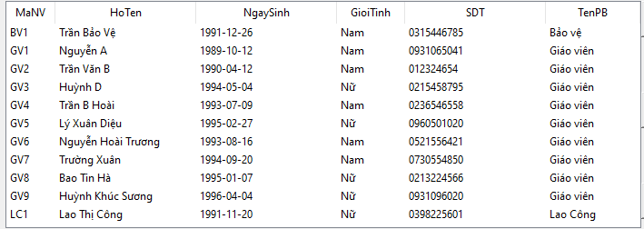
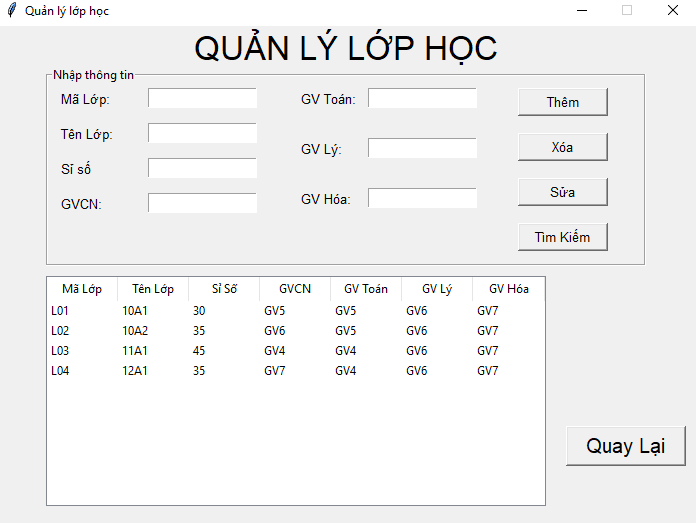

# Mô tả ứng dụng Quản lý Trường học -  Python Tkinter
## Sử dụng MySQL để xây dựng database cho phần mềm

## Giao diện đăng nhập

### Sau khi đăng nhập thành công với tên đăng nhập là "admin", mật khẩu là "123", giao diện đăng nhập sẽ chuyển sang giao diện chính của phần mềm

## Giao diện chính

### Ở bên bên trái giao diện chính là khung "Nhập thông tin", chứa các textbox để nhập và nhận thông tin. Cùng với các button với các chức năng cơ bản tương ứng như Thêm, Xóa, Sửa, Tìm kiếm và xuất DL.

### Với treeview bên dưới có vai trò là View đối với khung "Nhập thông tin"

### Thực hiện thao tác thêm mới nhân viên, ta điền đầy đủ thông tin cần nhập vào các textbox và ấn button "Thêm" để thực hiện thêm nhân viên mới:

### Muốn chỉnh sửa thông tin, ta chỉ cần điền vào mã nhân viên mà ta muốn sữa, chỉnh sửa lại thông tin mới trên textbox, vầ ấn button "Sửa" để thực thi cập nhận thông tin

### Để xóa nhân viên, ta chỉ cần click vào đầu dòng của nhân viên mà ta cần muốn xóa và thực hiện button "Xóa"

### Đối với chức năng "Tìm kiếm" thì ta sẽ thực hiện tìm kiếm theo ký tự mà ta đã nhập ở textbox "Tên NV"

### Chức năng "Xuất DL" sẽ xuất thông tin của treeview chính ra file excel data.xlsx

### Ngoài ra còn có các chức năng như lọc thông tin, nhằm giúp ta xem được các danh mục nhân viên của các nhóm chức vụ cụ thể một cách nhanh chóng, ở đây ví dụ như là nhóm "Giáo viên"

### Ngoài ra bên góc phải giao diện chính còn khung "Phòng ban" để xem và tạo mới các phòng ban có ở trường học.

### Button thoát sẽ đóng phần mềm hoàn toàn
### Với 2 button là "QL Tổ Môn" và "QL Lớp Học" sẽ đưa giao diện chính chuyển sang giao diện tương ứng theo tên button, gồm các chức năng tương tự như ở giao diện khung "Nhập thông tin"
### QL Tổ Môn

### QL Lớp Học

### Button "Quay Lại" ở 2 giao diện phụ này sẽ đóng giao diện hiện tại và đưa sang giao diện chính.
# End.